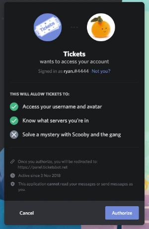
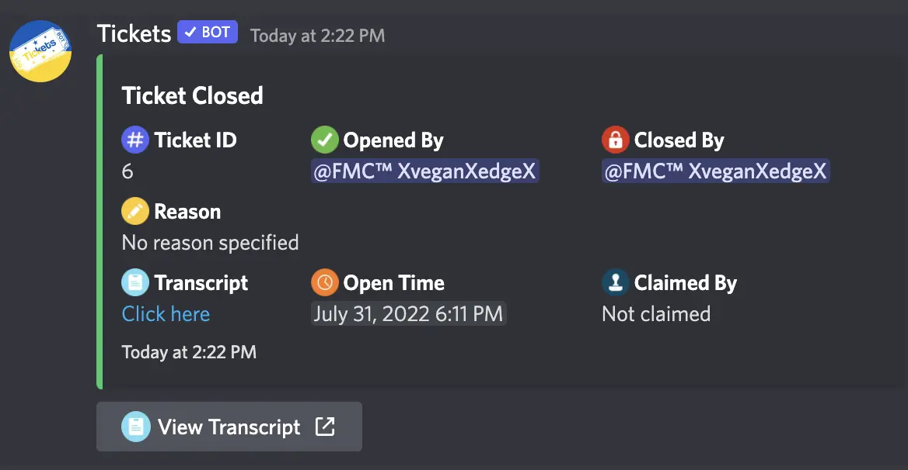
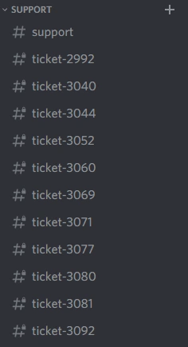

# Bot Configuration: WEB DASHBOARD
***
***

First, head over to the dashboard at [dashboard.ticketsbot.net](https://dashboard.ticketsbot.net). You'll be asked to login with Discord - simply click `Authorize` and you'll be taken back to the dashboard.

A list of servers which you are a Tickets bot administrator (`/addadmin`) and the bot has been invited to should show up. Simply click on the server you want to configure. If the server does not show up, ensure that you are either the owner of the server or have been added as a Tickets bot administrator by the owner using `/addadmin @YourUsername` and log out of, then back into, the dashboard.

You'll be taken to the settings page as follows:

You'll first want to pay attention to the main **Settings** card. Here you can edit the following settings:

## Prefix

> **Note:** prefix commands are no longer active! Tickets bot works solely on slash commands!

## Ticket Limit

This is the amount of tickets that a **single user** can have open **at a single time**. We usually recommend setting this to 1, but the default is 5.

For example, if you set this value to 1, a user will be able to open and close tickets an infinite amount of times, but only have a single ticket open at once. This value does not affect the total amount of tickets that can be opened at once in a server.

We do not impose any limits on the amount of tickets that a server can have open at once. However, please note that Discord only permits a total of 500 channels to exist in a server at once, and 50 channels to exist at once in a category. This means that you can move tickets to a new category if one gets filled, however you are limited to 500 channels overall by Discord.

## Allow Users To Close Tickets

This option specifies whether users are allowed to close their own tickets. If unchecked, only your support staff & administrators will be able to close them.

## Ticket Close Confirmation

This option specifies whether Tickets will send a confirmation message when closing a ticket via the 🔒`close` reaction. If checked, Tickets will send the following message after reacting:

Simply click the blue ✔️`close` reaction to confirm you want to close the ticket.

Close confirmation does not apply to tickets closed using the slash command `/close`.

## Welcome Message

The welcome message is the message displayed in the Ticket as soon as the user opens it:

> **Note:** the message has a maximum limit of 1024 characters due to Discord limitations.

- You may make use of placeholders in your welcome message. You can view a list of placeholders [here](./placeholders.md).  

- You may also use discord message formatting to include links to channels, emojis, roles, or usernames in your welcome message. **First**, you will need to have discord developer mode turned on - in your personal discord account settings > advanced > discord developer mode. **Second**, you can right click any channel name, username, message, etc and choose `Copy ID`.  **Third**, use the `structure` section of [discord's messge formatting chart](https://discord.com/developers/docs/reference#message-formatting) to include it in your welcome message.

The title of the embed will either be based off of the subject provided by the user when using `/open [Subject]`, or the title of the reaction panel if used. We are unable to get a subject from the user when using reaction panels currently, however, this will be possible in a future update of Discord.

## Transcripts Channel

When Tickets are closed, a transcript will automatically be recorded, encrypted, and stored in cloud based object storage - with no user interaction required.

A message, similar to the one following, will also be sent to your transcripts channel to notify you the ticket was closed and provide you with a link to the dashboard to view the archive:

This message will also be sent via direct messages to the user who opened the ticket. It is not possible to disable this functionality since we believe it is important for transparency purposes that users are also able to access the transcripts.

If you have privacy concerns, please join our [support server](https://discord.gg/VtV3rSk) to enquire. Unfortunately we are unable to answer any questions regarding your user data off-platform in order to verify your identity.

## Channel Category

Designates the channel category that tickets will be created under. If you are unsure what a channel category is, Discord has a guide explaining them available [here](https://support.discord.com/hc/en-us/articles/115001580171-Channel-Categories-101).

Your tickets will be grouped together under the category as follows:

## Overflow Category

Discord has an imposed limitation that each Channel Category can only hold 50 channels. Once you hit this limit, Tickets bot will fail to be able to open more ticket channels for you and your server members. To help rectify this, you can set an Overflow Category. This is a category that the ticket channels will open in once your selected Channel Category has hit the Discord imposed limit.

## Naming Scheme

Defines how the ticket channels should be named. Currently, the 2 options are by ticket ID (`#ticket-1`) or by username (`#ticket-name`). You can define more [custom naming schemes](./panels.md#naming-scheme) in the settings of individual reaction panels, instead of this overall setting.

## Submission

Once you are satisfied with your settings, press the `Submit` button to save them. An example follows:

We now have the basic configuration completed!

You may wish to configure the following options next:
- [Reaction Panels](./panels.md)
- [Claim Settings](../dashboard/settings/claiming.md)
- [Auto Close](../dashboard/settings/settings.md/#auto-close)
